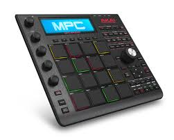

 


# MPC Studio Black - Midi Speceification
* [Overview](#overview)  
* [PAD Note Mapping](#PADNoteMapping)  
* [Function Buttons Mapping](#FunctionButtonsMapping)  
* [Q-Link Knobs](#QLinkKnobs)  
* [Jog Wheel](#JogWheel)  
* [Button Controls](#ButtonControls)  
* [Button LED Feedback](#ButtonLEDFeedback)  
* [Pad LED Feedback](#PADLEDFeedback)  
* [LCD Screen](#LCDScreen)  


## Overview
<a name="overview" ></a>
This repository holds the midi specification for the MPC Studio Black. This information was not provided by AKAI Professional, and I am not affiliated with them in any manner. I am simply an owner of the product and have documented it's MIDI protocol for my personal use. The repo is a product of that my findings.

<a name="PADNoteMapping" ></a>
## PAD Note Mapping
The pads on the MPC Studio Black communicate on channel 10(channel 9 in code) and are not mapped in contiguous numbers. They send NoteOn, NoteOff, and Aftertouch messages for each pad. Listed below is the mapping from Pad number to note. 

|Channel|Note|Pad Number|
|-------|----|----------|
|9      |37  |1         |
|9      |36  |2         |
|9      |42  |3         |
|9      |82  |4         |
|9      |40  |5         |
|9      |38  |6         |
|9      |46  |7         |
|9      |44  |8         |
|9      |48  |9         |
|9      |47  |10        |
|9      |45  |11        |
|9      |43  |12        |
|9      |49  |13        |
|9      |55  |14        |
|9      |51  |15        |
|9      |53  |16        |


## Function Buttons Mapping
<a name="FunctionButtonsMapping" ></a>
The Function buttons to immediately North of the top row of Pads communicate on channel 1(0 in code), and send only NoteOn Message. On Press, the Function buttons send a velocity value of 127. On release, the buttons send a velocity of 0, which your daw will recognize as a NoteOff value, but it's important for you to know if you decide to develope custome software for this device. Listed below is a table for the Function Button Mapping.

|Channel|Note|Function Button|
|-------|----|------------|
|0      |12  |f1          |
|0      |13  |f2          |
|0      |14  |f3          |
|0      |15  |f4          |
|0      |33  |f5          |
|0      |34  |f6          |

## Q-Link Knobs
<a name="QLinkKnobs" ></a>
The QLinkj knobs to the left side of the controller send two types of messages:
* **NoteOn**: The knobs are touch sensitive. On touch, it will send NoteOn with velocity 127. On Release, it will send NoteOn with velocity 0.
* **ControlChange**: When turning the knob, they will send CC values from 0-127

The Scroll knob is not touch sensitive.

Listed below is a table mapping the knobs to there corresponding ControlChange values.
|Channel|CC(Control Change) |QLINK|
|-------|---|-----|
|0      |101 |Scroll|
|0      |16 |QLink1|
|0      |17 |QLink2|
|0      |18 |QLink3|
|0      |19 |QLink4|


## Jog Wheel
<a name="JogWheel" ></a>
The Jog wheel is the only endless encoder on the device. It sends a signed bit on CC 100. This means it sends the following values when turned:
* **Clockwise turn**: MSG= channel:0, cc: 100, value: 1
* **Counter turn**: MSG= channel:0, cc: 100, value: 127


## Button Controls
<a name="ButtonControls" ></a>
The buttons on the MPC Studio Black primarily send NoteOn values of 127 for press and 0 for release. There are however a few buttons that send CC message in the same range instead of NoteOn message. The table below lists all the button mappings:

|Channel|Note|Name        |Control Change|
|-------|----|------------|--------------|
|0      |35  |PadBankA    |n/a           |
|0      |36  |PadBankB    |n/a           |
|0      |37  |PadBankC    |n/a           |
|0      |38  |PadBankD    |n/a           |
|0      |39  |FullLevel   |n/a           |
|0      |40  |16Level     |n/a           |
|0      |41  |StepSeq     |n/a           |
|0      |42  |NexSeq      |n/a           |
|0      |43  |TrackMute   |n/a           |
|0      |2   |ProgEdit    |n/a           |
|0      |3   |ProgMix     |n/a           |
|0      |4   |SeqEdit     |n/a           |
|0      |5   |SampleEdit  |n/a           |
|0      |8   |Song        |n/a           |
|0      |44  |Project     |n/a           |
|0      |45  |SeqEdit     |n/a           |
|0      |46  |Prog        |n/a           |
|0      |47  |Sample      |n/a           |
|0      |48  |NoFilter    |n/a           |
|0      |52  |Main        |n/a           |
|0      |111 |Numeric     |n/a           |
|0      |49  |Shift       |n/a           |
|0      |50  |Browser     |n/a           |
|0      |55  |DataMinus   |n/a           |
|0      |54  |DataPlus    |n/a           |
|0      |51  |Window      |n/a           |
|0      |53  |TapTempo    |n/a           |
|0      |56  |Up          |n/a           |
|0      |57  |Down        |n/a           |
|0      |65  |Left        |n/a           |
|0      |66  |Right       |n/a           |
|0      |67  |Undo        |n/a           |
|0      |n/a |**StepLeft**    |115           |
|0      |n/a |**StepRight**   |116           |
|0      |70  |GoTo        |n/a           |
|0      |71  |BarLeft     |n/a           |
|0      |72  |BarRight    |n/a           |
|0      |n/a |**Record**      |119           |
|0      |n/a |**Overdub**     |114           |
|0      |n/a |**Stop**        |117           |
|0      |n/a |**Play**        |118           |
|0      |n/a |**PlayStart**   |113           |
|0      |113 |QLinkTrigger|n/a           |
|0      |9   |Erase       |n/a           |
|0      |11  |NoteRepeat  |n/a           |


## Button LED Feedback
<a name="ButtonLEDFeedback" ></a>
The MPC Studio Black is able to light the LEDs behind certain buttons using CC *(Control Change)* messages sent on channel 0 *(zero is channel one when observing midi and developing)*. 

#### Button Types
There are two types of LED buttons on this controller. **One Color** and **Two Color**. 
* **One Color**: These buttons light up with one color by sending a CC value of 1 to the controller on channel 0, and the corresponding note(0-127)
    * CC#: 0 = OFF
    * CC#: 1 = ON
* **Two Color**: These buttons light up with two colors by sending a CC value of (0-2) to the controller on channel 0, and the corresponding note(0-127)
    * CC#: 0 = OFF
    * CC#: 1 = ON - 1st Color
    * CC#: >=2 = ON - 2nd Color

Listed below is a table for all LED buttons on the controller.
You may use this table to send messages and light the buttons. Here is an example Midi Message in different formats...

Suppose I wanted to light the ProgEdit button with the second color. Using the table below, here is sudo python code to accomplish this.

```python
# Import mido
import mido

# List all output ports
ports = mido.get_output_names()

# Select and instantiate the correct port
portIndex: int = 6
outport = mido.open_output(ports[portIndex])

# Create the msg to send (disreagard time for this example, n/a)
msg = Message('control_change', channel=0, control=2, value=2, time=0)

# Send the message
outport.send(msg)

```

|Channel | Note/Data1 |Name |Button Type |
|-------|----|------------|---------|
|0      |2   |ProgEdit    |two_color|
|0      |3   |ProgMix     |two_color|
|0      |5   |SeqEdit     |two_color|
|0      |6   |SampleEdit  |two_color|
|0      |8   |Song        |two_color|
|0      |35  |PadBankA    |two_color|
|0      |36  |PadBankB    |two_color|
|0      |37  |PadBankC    |two_color|
|0      |38  |PadBankD    |two_color|
|0      |39  |FullLevel   |one_color|
|0      |40  |16Level     |one_color|
|0      |41  |StepSeq     |one_color|
|0      |42  |NextSeq     |one_color|
|0      |43  |TrackMute   |two_color|
|0      |44  |Project     |one_color|
|0      |45  |Seq         |one_color|
|0      |46  |Prog        |one_color|
|0      |47  |Sample      |one_color|
|0      |48  |NoFilter    |one_color|
|0      |50  |Browser     |one_color|
|0      |51  |Window      |one_color|
|0      |52  |Main        |two_color|
|0      |53  |TapTempo    |one_color|
|0      |67  |Undo        |one_color|
|0      |73  |Rec         |one_color|
|0      |80  |OverDub     |one_color|
|0      |82  |Play        |one_color|
|0      |112 |PadAssign   |one_color|
|0      |113 |QlinkTrigger|one_color|


## PAD LED Feedback
<a name="PADLEDFeedback" ></a>
The PADs are backlit with RGB LED lights. Unlike the MPC Studio Mk2, the PAD LEDs are controlled through sending CC(Control Change) messages on channel 10(9 in code) corresponding to the note of the pad. So given the table below, you can light up PAD 1 my sending a the following Message:

```
msg: channel=9, message="control_change", cc=37, value=127
```

|Channel|CC Number|Pad Number|
|-------|----|----------|
|9      |37  |1         |
|9      |36  |2         |
|9      |42  |3         |
|9      |82  |4         |
|9      |40  |5         |
|9      |38  |6         |
|9      |46  |7         |
|9      |44  |8         |
|9      |48  |9         |
|9      |47  |10        |
|9      |45  |11        |
|9      |43  |12        |
|9      |49  |13        |
|9      |55  |14        |
|9      |51  |15        |
|9      |53  |16        |

From what I can observe now, the Pads seem to be bound to only displaying red-green spectrum. This pattern is extrapolated over the 64 possible values, in groups of 8
each power of eight seems to raise the brightness of the color, while the sub_power changes the hue. It seems to be layed out in this pattern.
```
0-7
8-15
16-23
24-31
32-39
40-47
48-55
56-63
64 starts the pattern all over again
```

8-15 will give you a different hue, but traversing the power of eight will change the brightness.

I'm almost positive that there is a more concise way to draw color on the MPC Studio Black, but no sysex protocol was provided by Akai. Any assistance here is appreciated.

## LCD Screen
<a name="LCD Screen" ></a>
The LCD screen on the MPC Studio Black is a 360px x 96px dot matrix screen. That means it has 360 on/off pixels horizontally, and 96 on/off px vertically. The screen data is sent to the device via Sysex messages sent from the host application(MPC Software 2). The data is sent to the controller from left->right, top->bottom, in a row by row fashion. It does this using 120byte buffers on/off data for 3 pixels contained in one byte. That 120byte buffer is sent 96 times per frame to fill the screen. There doesn't seem to be any time out once the data is sent, and no need to meet any particular FPS for the LCD screen. From my observations, you only need to send screen data if the display needs to be updated *(Could be wrong here...)* Listed below is breakdown of the sysex message. This data is in HEX format.

#### Sysex Header
Each message starts with a header to identify the device and type of message being sent. Here is the screen message header.

```python
# I'm using a python list to represent the data, but the same can be done in any language.

# The first 4 bytes are standard sysex id stuff: Manufacture, Device, Model, product etc...
# The remaining bytes pertain to the message type, but are unknown.
msg_header = [0x47 ,0x7f, 0x3d, 0x04, 0x00, 0x7e, 0x02, 0x68, 0x00, 0x00, 0x00]
```
#### The line # byte
The next byte in the sequence is the line number. This is a number from 0-95 and determines the line to fill.

```python
line0=0
msg_header.append(line0)
```

#### The pixel data
The pixel data is not standard RGB or any representation of that BGR565, RGB24. The pixel only needs on/off bit. Because of this, they have chosen to represent three pixels worth of data in one byte by setting bits of 3. Here is a diagram of of the pixel encoding per byte.

* x = pixel on
* _ = pixel off

```
_ _ _ = 0x00
x _ _ = 0x30
x x _ = 0x3c
x x x = 0x3f
_ x x = 0x0f
_ _ x = 0x03
_ x _ = 0x0c

```

With this encoding, a stride of 360 pixel can be represented in 120 bytes buffer. The complete Sysex data would be something like this: **Capture taken from USBPCap/Wireshark**

```
# sysex start
f0 

# header
47 7f 3d 04 
00 7e 02 68 00 00 00 

# line number
40

# 120 byte stride 
0f 03 3f 3f 3f 3f 0f 33 30 0f 00 3f 30 0f 3f 3f 3f 3f 3f 30 03 00 00 00 00 30 0c 0f 0c 0f 3c 0f 30 0f 30 00 00 00 00 30 03 00 00 00 03 00 30 00 0f 3c 0f 30 30 30 00 00 00 00 00 03 00 00 00 00 03 00 30 00 0f 3c 0f 30 30 30 00 00 00 00 00 30 03 00 00 00 00 00 30 0c 0f 0c 03 30 0f 30 00 00 00 00 00 30 03 00 00 00 00 00 3f 30 0f 30 0f 30 0f 30 00 00 00 00 00 30 

# sysex end
f7

```

With that, you should be able to send data to the screen.  You would still need some 2D graphics library such as cairo, blend2d, pillow, etc, to craft your display. But once you have a bitmap of the 360x96, you could:
* loop over each pixel in the bitmap buffer: 
* encode every three pixels into one byte on/off, 
* push encoded byte to sysex payload buffer: 
* build your complete sysex message
* send to device

There may be a way to chuck multiple lines in one sysex call. This has not been tested, but if anyone reading this wants to give it a try, I'll be more than willing to update the repository to reflect your findings. Sending sysex data is not particularly fast because it's still just a midi message, but fortunately, its only 360x96 bytes of data being sent, so most languages should be able to generate and send this data without issue *(Even slow python)*

Im working on a python implementation for the screen and I will upload the repository once I get it in working fashion. 

## Conclusion

There are many DAWs that support controller scripting at the moment, so it is possible to use this controller with those DAWs. The issue that I have run into is implementing the Display with these daws. Generating graphical displays is normally done using lower level libraries, usually implemented in C / C++. While these tools have bindings for other higher level scripting languages, they are not commonly supported in the scripting environments given to us by the DAW manufacture.

One workaround to this could be to write a custom sort of driver, that implements the graphical display for a controller. Use that "driver" as a middle-man between the DAWs scripting env and the controller. Have the "driver" install a virtual midi port. Send all data to the virtual MIDI port, and use the driver to interpolate that data, and show the appropriate screen/led feedback.

This is a lot of work, and carries the risk of jeopardizing the manufacturers functionality of the device, but for older devices that aren't currently supported ie(MPC Studio Black) it could be worth it in the end.